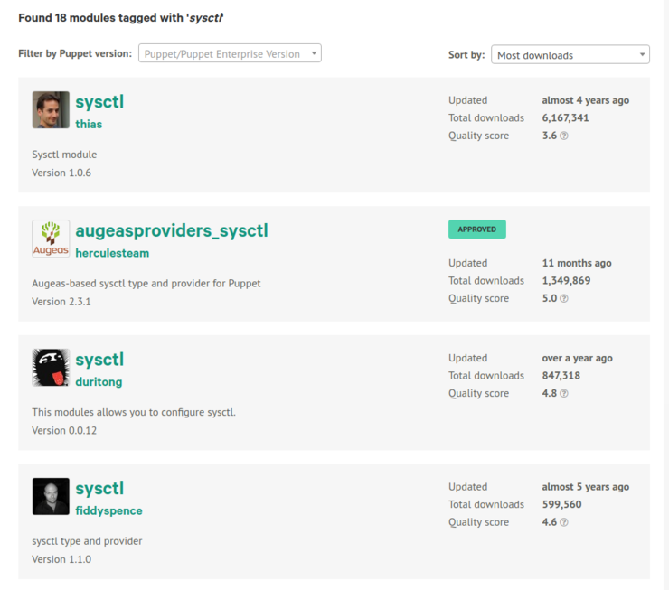

<!SLIDE >
# Not always quite as bad

    @@@ Puppet small
    class base::hardening {
      file_line{'3.2.3_all_secure_redirect':
        ensure => present,
        path   => '/etc/sysctl.conf',
        line   => 'net.ipv4.conf.all.secure_redirects = 0',
        match  => '^net.ipv4.conf.all.secure_redirects = 0',
      }
      exec { '3.2.3_all_secure_redirect_exec':
        command => '/usr/sbin/sysctl -w net.ipv4.conf.all.secure_redirects=0',
        onlyif  => '/usr/sbin/sysctl net.ipv4.conf.all.secure_redirects | grep -v 0',
      }
      file_line{'3.2.3_default_secure_redirect':
        ensure => present,
        path   => '/etc/sysctl.conf',
        line   => 'net.ipv4.conf.default.secure_redirects = 0',
        match  => '^net.ipv4.conf.default.secure_redirects = 0',
      }
      exec { '3.2.3_default_secure_redirect_exec':
        command => '/usr/sbin/sysctl -w net.ipv4.conf.default.secure_redirects=0',
        onlyif  => '/usr/sbin/sysctl net.ipv4.conf.default.secure_redirects | grep -v 0',
      }

      # ...
    }

~~~SECTION:notes~~~
* Maybe this is just broken, but we can make it less broken.
~~~ENDSECTION~~~
<!SLIDE >
# How to improve this?

    @@@ Puppet
    define base::hardening::sysctl (
      $value,
    ) {
      file_line { "sysctl.conf for ${name}":
        ensure => present,
        path   => '/etc/sysctl.conf',
        line   => "${name} = ${value}",
        match  => "^${name} = ${value}", # Is this even right??
      }
      exec { "sysctl for ${name}":
        command => "/usr/sbin/sysctl -w ${name}=${title}",
        onlyif  => "/usr/sbin/sysctl ${name} | grep -v ${value}",
      }
    }

#### Using the type
    @@@ Puppet
    base::hardening::sysctl { '3.2.3_all_secure_redirect':
      value => 0,
    }
    base::hardening::sysctl { '3.2.3_default_secure_redirect_exec':
      value => 0,
    }

<!SLIDE >
# Was this really the right solution?

**Nope!**

<!SLIDE bullets incremental>
# Choosing a good Forge module

* Spoilt for choice
* thias/sysctl - Defined type, but *much* better than ours.
* fiddyspence/sysctl - Native puppet type (implementing `instances` etc)
* herculesteam/augeasproviders\_sysctl - Approved module which provides a native type that leverages augeas
